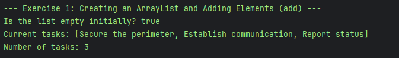
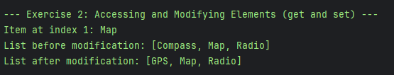
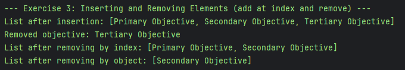
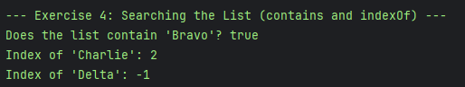
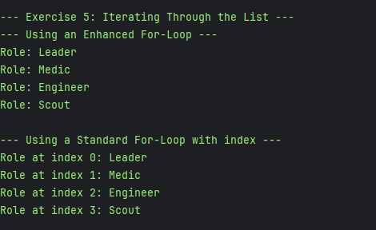
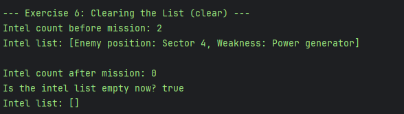

# JC-Exploring-Arraylist

**Your Name: General Malit**

## Exploring Java `ArrayList`

---

### Exercise 1: Creating an ArrayList and Adding Elements (add) Output

---

### Exercise 2: Accessing and Modifying Elements (get and set) Output

---

### Exercise 3: Inserting and Removing Elements (add at index and remove) Output

---

### Exercise 4: Searching the List (contains and indexOf) Output

---

### Exercise 5: Iterating Through the List Output

---

### Exercise 6: Clearing the List (clear) Output

